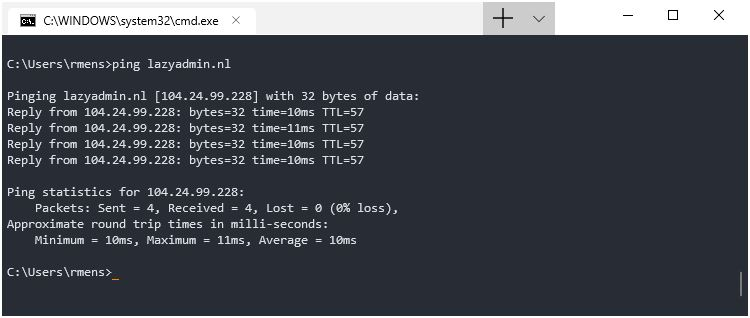

## Preparación del sistema - configuración de las máquinas remotas
    En las siguientes secciones se va a proceder a explicar aquellas acciones tomadas
    como preparativos para el desarrollo de esta y las siguientes prácticas.

    En resumen se trata de la creación de dos máquinas virtuales bajo la estructura IaaS.
> IaaS hace referencia a Infrastructure as a Service, más información en [Microsoft Azure](https://azure.microsoft.com/en-us/overview/what-is-iaas/).

> imagen de cabecera de lo que sería un servicio IaaS

    Este tipo de servicios permite gestionar de maner ainstantanea una infraestructura 
    computacional que es gestionada y provisionada directamente desde internet. Evitamos
    muchos quebraderos de cabeza respecto a cuestiones de hardware y disponibilidad de 
    espacio. Este tipo permite aumentar o decrementar muchas características bajo demanda.

El objetivo de esta parte de la práctica, que fue la primera, era **montar una infraestructura** 
sobre la cual poder trabajar todos aquellos aspectos a desarrollar durante las prácticas.

La infraestructura se compondría de **dos máquinas**, un **cliente** y un **servidor**. Ambas 
máquinas debían no solo configurarse con un sistema operativo concreto y unos paquetes 
necesarios para el desarrollo de la materia, sino que también era preciso configurar una 
tarjeta de red que vinculase ambas máquinas por una intranet. 

Ambos servidores fueron creados bajo el **servicio IaaS** proporcionado por la **ULL** e 
inicializados con el sistema operativo CentOS mediante un paquete de instalación predefinido.
El propósito de usar dicha plantilla es agilizar este apartado y  evitar posibles errores que
pudieran perjudicar el uso de la máquina o ralentizar la actividad.

Cabe hacer mención a que todos los datos y sistemas que se crean **residen en un CPD** que 
realmente **existen y son clusters físicos**. Sin embargo *oVirt* hace de **interfaz** y hace 
transparente toda esa infraestructura para poder centrarnos en el empleo y administración de 
las máquinas virtuales.
> El acceso a estas está protegido de manera que solo se pueda acceder **usando una VPN** o desde 
> la propia red de la ULL

### Características comunes a ambas máquinas

Tanto la máquina que actúa de servidor como el cliente presentan similitudes en cuanto a su 
configuración:
- Ambas usan [**CentOS**](https://www.centos.org/ "link a la página oficial de CentOS")
- Ambas tendrán un usuario y un root inicialmente
    > Claramente con contraseñas distintas y personales
- Ambas partes serán configuradas en cuanto a la interconectividad
    > Se ahonda más adelante sobre este aspecto

### Configuración de la máquina virtual

El proceso para iniciar y configurar una máquina virtual mediante el oVirt es tan sencillo 
como **emplear la interfaz gráfica** para crearla y luego en los menús de selección introducir
las opciones. 

No vamos a ahondar mucho más en este aspecto ya que está expuesto y documentado en el
[campus virtual](https://campusvirtual.ull.es/1920/pluginfile.php/253251/mod_resource/content/3/ull-cloud.pdf)

### Configuración manual de la interfaz de red

Tras haber hecho la instalación de la máquina y configurado algunos aspectoos del sistema, toca el turno de **establecer una interfaz de red** que comunique el cliente y el servidor.

En una primera instancia debemos acceder al directorio del sistema operativo que maneja los 
archivos dedicados a esta labor, osea  ***/etc/sysconfig/network-scripts***. Es en esta ruta 
donde tendremos que echar mano de crear el archivo  ***ifcfg-eth[numero]***  que contendrá la 
información pertinente a un puerto de **comunicación ethernet**.
1. realizamos una *copia* de alguno ya existente. En caso general *ifcfg-eth0*
2. **modificamos y borramos** algunas de las opciones (BOOTPROTO, DEVICE, ...)
3. **añadimos** la opción de dirección IP y NETMASK acorde a nuestro vínculo de comunicación.

El servidor y el cliente se corresponden por una dirección IP similar que los identifica por pares, es decir  *192.168.50.numero_par*  *192.168.50.numero_impar*.

Tras haber hecho esta configuración solamente resta reiniciar el servicio
> Para esto hemos usado el comando *systemctl [opción] [servicio]*

Este proceso hay que realizarlo **tanto en el cliente como el servidor**, determinando una 
dirección IP a cada uno. Se puede comprobar dicho vínculo usando el comando *ping*.
> Su uso es: *ping dirección*

De establecerse con éxito una conexión se empezarían a **mostrar paquetes**, tal y como muestra la imagen siguiente:

 

